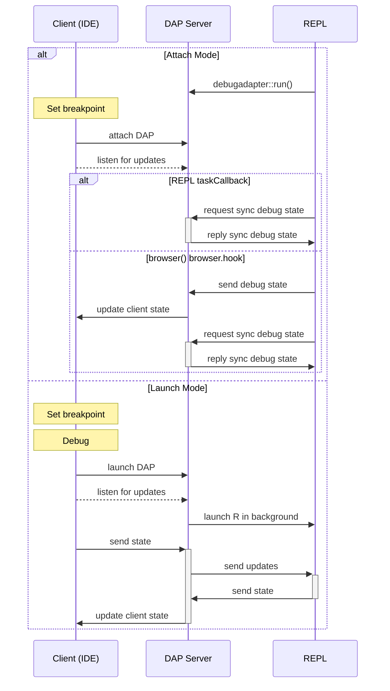
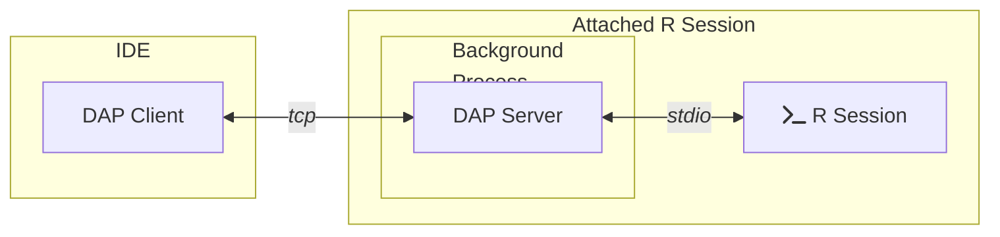
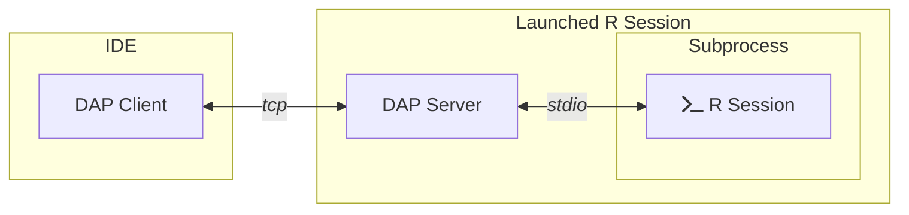

# `debugadapter` 


An implementation of the [Debug Adapter
Protocol](https://microsoft.github.io/debug-adapter-protocol/) for R

> **Status: Reincarnated! :zombie:** 
>
> It recently came to my attention that R received an experimentel feature
> in `devel` that would make this project much more realistic. 
>
> Current work focuses on this feature to test the viability for this purpose.
> 

`debugadapter` operates in one of two ways:

1. `execute` mode, where A file is used as a script for execution, in which 
   case `debugadapter` will launch a new debug server, register breakpoints and
   provide a debug `REPL` within your client if it provides the capability and
   allow you to step through the script (not currently implemented).

2. `attach` mode, where your client will attach to a running server, running
   as a background process to an interactive session.

   ```r
   # start a server in the background
   debugadapter::run()  

   # execute some code which will hit a breakpoint and debug as usual
   my_code_to_debug()
   # debugging at my_nested_fn_call(...) #123
   # Browse[0]> 
   # ...
   ```

## Getting Started

Follow the instructions below to launch your debug server, then follow the 
instructions for your [client of choice](#clients).

**1. Installation**

```r
pak::pkg_install("dgkf/debugadapter")
```

**2. Starting the Server**

Regardless of your client, running a server is always the same. In `R`, run:

```r
debugadapter::run()
```

For testing or development, you may consider setting the option
`debugadapter.log` to configure the log level. One of `1` (trace),
`2` (debug) or `3` (info - default).


**3. Set a Breakpoint**

From your IDE's `DAP` client, set a breakpoint. See a list of [client
instructions](#clients) below to configure your IDE.

> Not that debugging breakpoints aren't recognized from the R session until
> after the next top-level command finishes (see #4 for details).

**4. Debug!**

:construction: Work-in-progress :construction:

Currently, nothing will happen. Communication about the current debugger state
back to the client is in early development. 

The intention is that debugging within the running R session relays information
about the current state of the debugger back to your debug client so that the
current scope and environment are communicated back to your client as you step
through your code.

Likewise, using your IDE's debug controls to step through code progress 
debugging on the R session.

### Clients

#### neovim (`nvim-dap`)

We first need to provide neovim with instructions for attaching to a running R
session when we activate a debugger (most often with a a `:DapContinue` command)

Within your `nvim` configuration files:

```lua
local dap = require('dap')

dap.adapters.r = {
  type = 'server',
  port = 18721,  -- needs to match `debugadapter::run()`'s `port` argument
}

dap.configurations.r = {
  {
    type = 'r',
    requests = 'attach',
    name = 'Attach session'
  }
}
```

## Architecture

Attaching an interactive R session relies on the coordination of
multiple R processes:

1. **DAP Server**  
   A socket-based server used for communicating with the debug client. 
   When run in the background, the debugger state is synchronized after
   each top-level task and before entering a REPL-based debugger.

1. **R Session**  
   The interactive R session serves as the parent to the DAP server and
   the `browser()` REPL, allowing for iterative debugging in a persistent
   R session.

1. **forked `browser()` process**  
   When `browser()` would be called, it is instead launched in a forked
   process, which allows the interactive R session to step through the 
   debugger while also querying for various debugger context required
   by the debug client. Unfortunately, this means that this approach is
   currently not supported on Windows. 

### Debugging Loop



This is all orchestrated using a web of connections between each 
of the processes. The exact layout is in flux as the project matures.

### Attach Mode



### Launch Mode



## Prior Art

### [`vscDebugger`](https://github.com/ManuelHentschel/vscDebugger)

An existing implementation that originated as a VSCode extension. 
While that package seems to work well in VSCode, it has been on
a long path to being more editor agnostic. `debugadapter` deviates from 
the design choices of this package in two key ways: 

- A pure R package for simpler portability
- Prioritzing a use case where an arbitrary terminal can be 
  attached to the debug client and integrate with an interactive 
  R session.
